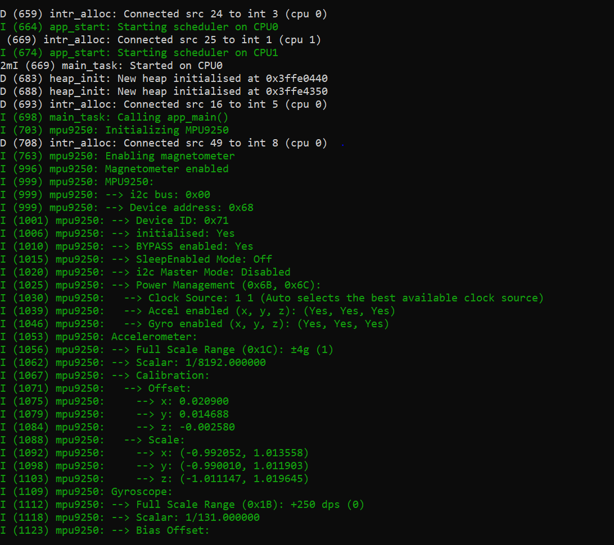
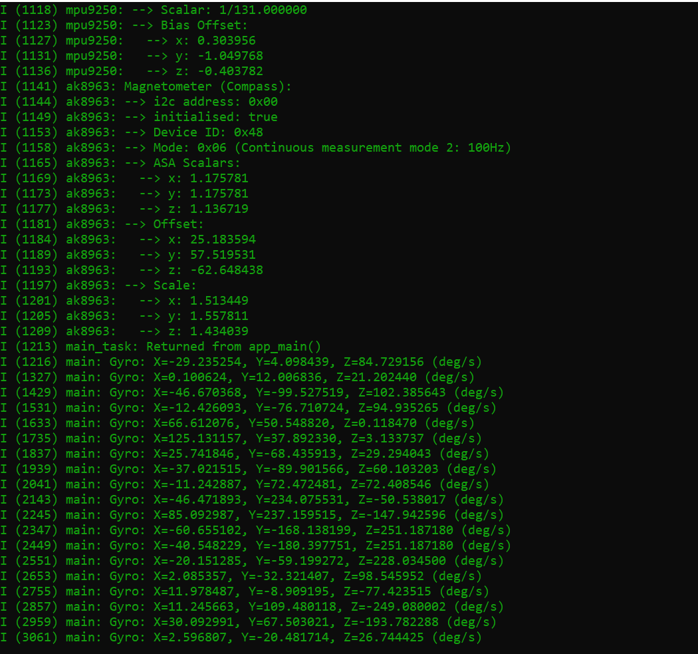

# MPU9250 Driver for ESP32 with I²C Debug Logging

This project contains an MPU9250 (9-axis IMU) driver for **ESP32** with integrated I²C debug logging.  
It initializes and configures the gyroscope, accelerometer, and magnetometer, then outputs real-time sensor readings.  
The I²C communication process has been made transparent by adding detailed debug logs for register reads/writes.

The code uses:
- **ESP-IDF**
- **FreeRTOS**
- Custom I²C helper functions (`i2c-easy.c`)
- MPU9250 + AK8963 initialization and calibration routines

---

## Hardware

- **MCU:** ESP32  
- **IMU:** MPU9250 (Gyroscope, Accelerometer, Magnetometer)  
- **Communication:** I²C @ 200 kHz  

**Pin Assignment:**
- **SDA:** GPIO21
- **SCL:** GPIO22

---

## Features

- MPU9250 initialization with detailed register dumps
- Magnetometer (AK8963) configuration
- Gyroscope, Accelerometer, and Magnetometer calibration parameters applied at startup
- Continuous gyro data reading loop with FreeRTOS task delay
- I²C debug logging showing each read/write transaction
- Limited sample mode (stop after N readings for testing)

---

## Build & Flash

```bash
idf.py set-target esp32
idf.py build
idf.py flash monitor

```
## Example Output



## How It Works

### 1. Initialization
- The **MPU9250** and **AK8963** are initialized via I²C.  
- Register settings for:
  - Scale ranges
  - Offsets
  - Calibration constants  
  are applied at startup.

---

### 2. I²C Communication
- All sensor reads/writes go through `i2c-easy.c` functions.
- Debug logs show each command in the sequence:
  1. **Start condition**
  2. **Device address**
  3. **Register address**
  4. **Data bytes**
  5. **ACK/NACK responses**
  6. **Stop condition**

---

### 3. Gyroscope Loop
- Reads **X, Y, Z** angular velocity in **deg/s**.
- Updates every **100 ms** using `vTaskDelay()`.
- Stops after **10 samples** in limited mode.